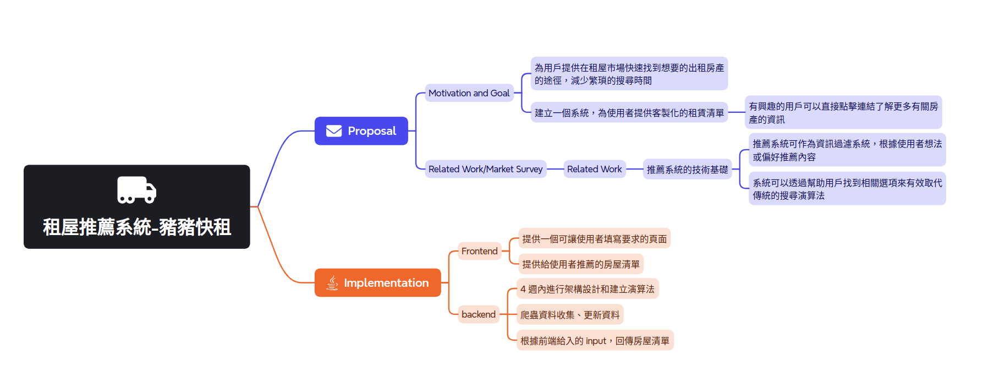

# 雲端平台實務與應用期末專案 - 租諸快租(租屋推薦系統)
## Proposal
### Motivation and Goal
* 提供使用者在租屋市場中快速找到其想要的物件，減少繁瑣、亂找的時間
* 建立一個系統能提供使用者快速找到想要的租屋處清單
    * 如果使用者對這個物件感興趣，就可以直接點擊連結

### Related Work/Market Survey
> Related Work
* 推薦系統的技術基礎
    * 推薦系統是一種訊息過濾系統，根據用戶對物品的「評分」或「偏好」來推送相應內容。
    * 推薦系統可以有效代替搜尋演算法的方式，因為他們幫助用戶找到一些他們自己沒有辦法找到的物品。
* 台灣的租屋市場現況
    * 根據**內政部不動產資訊平台**的數據顯示，台灣的租屋市場存在地域集中化、租金不均及學生/年輕上班族需求量大的特徵。
* 租屋需求與環境因素的結合
    * 台灣租屋市場中環境因素（如空氣污染、交通便利性、嫌惡設施）與房客偏好的關係，租客往往需要花費大量時間來思考哪些房子是它喜歡的、是它不喜歡的。

> Market Survey
* 現有租屋平台的功能比較
    * 租屋推薦系統只針對市面上的待租屋物件，提供其 591、信義租屋、永慶房屋等上面的物件進行比較，並提供連結，沒有後續服務
    * 更針對使用者的情境做考量，透過問答方式，提供給使用者更簡潔、輕鬆的方式來選擇物件，例如
        * 想住在哪條街附近幾公里內
        * 希望離捷運站多近、不感興趣
        * 可否養寵物
        * 可開伙
        * 可否有電梯

### Users
* 以學生租屋、情侶租屋、非家庭型態的租客，都可以先到推薦系統上進行初步塞選。

### Explanation of product features 
* 用戶可以使用豬豬快租APP的搜索功能，根據地區、房間數量、租金範圍等條件進行檢索。搜索結果會顯示所有符合條件的房源信息，包括地址、房間數量、租金、以及房屋的照片等。用戶可以通過查看房屋照片，此外還有更細節的過濾功能，例如：附近超市、學校、公交站等，或是用戶需要的配備，例如：空調、洗衣機等。可以讓用戶輕鬆的找到滿足自己需求的房源，快速了解房屋的狀況。
* 豬豬快租APP的租屋系統還提供了地圖功能。用戶可以在地圖上查看房源的位置，並根據自己的需求選擇符合條件的房源，還支持在線租房，用戶可以直接在APP上選擇房源並與房東聯繫，簽署租約並繳納押金。這樣可以使租房過程更加便捷，也減少了紙質文件的流通。

<!-- * 前端 
    * 使用 `react`
    * 提供一個可讓使用者進行問答的頁面。
    * 。
* 後端
    * 使用 `python`
    * 根據前端給入的 input/output，回傳房屋清單 -->

### Mind Map
>